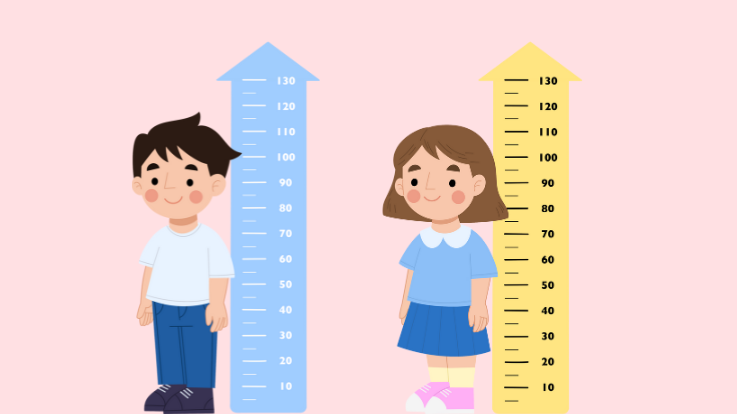

# Sistem Deteksi Stunting

<p align="center">
    
</p>

<p align="center">
    <a href="https://github.com/ISHASII/web-stunting"></a>
    <a href="#"></a>
    <a href="#"></a>
    <a href="#"></a>
</p>

## Tentang Proyek

Sistem Deteksi Stunting adalah aplikasi web yang dirancang untuk membantu tenaga kesehatan dalam mendeteksi dini stunting pada anak-anak. Sistem ini menggunakan standar WHO untuk menghitung Z-Score dan memberikan analisis status gizi secara real-time.

### Fitur Utama

-   **Manajemen Data Anak**: Pencatatan lengkap data anak termasuk informasi personal dan foto
-   **Pengukuran Komprehensif**: Monitoring tinggi badan, berat badan, lingkar kepala, dan lingkar lengan atas
-   **Analisis Z-Score**: Perhitungan otomatis berdasarkan standar WHO
-   **Deteksi Stunting**: Klasifikasi status gizi (Normal, Stunting, Severely Stunting)
-   **Dashboard Admin**: Panel kontrol untuk superadmin dan petugas kesehatan
-   **Laporan & Export**: Ekspor data individual dan laporan komprehensif
-   **Galeri Kegiatan**: Dokumentasi program pencegahan stunting
-   **Responsive Design**: Antarmuka yang modern dan responsif

### Teknologi yang Digunakan

-   **Framework**: Laravel 11.x
-   **Database**: SQLite (default), MySQL compatible
-   **Frontend**: Blade Templates, Tailwind CSS
-   **Authentication**: Laravel Sanctum
-   **File Storage**: Laravel Storage (Public disk)
-   **Export**: Laravel Excel (PhpSpreadsheet)
-   **Charts**: Chart.js
-   **Icons**: Heroicons

## Persyaratan Sistem

-   PHP >= 8.2
-   Composer
-   Node.js & NPM
-   SQLite atau MySQL
-   Git

## Instalasi

### 1. Clone Repository

```bash
git clone https://github.com/ISHASII/web-stunting.git
cd web-stunting
```

### 2. Install Dependencies

```bash
# Install PHP dependencies
composer install

# Install Node.js dependencies
npm install
```

### 3. Konfigurasi Environment

```bash
# Copy file environment
cp .env.example .env

# Generate application key
php artisan key:generate
```

### 4. Konfigurasi Database

Edit file `.env` dan sesuaikan konfigurasi database:

```env
DB_CONNECTION=sqlite
DB_DATABASE=database/database.sqlite

# Atau jika menggunakan MySQL:
# DB_CONNECTION=mysql
# DB_HOST=127.0.0.1
# DB_PORT=3306
# DB_DATABASE=deteksi_stunting
# DB_USERNAME=root
# DB_PASSWORD=
```

### 5. Migrasi Database

```bash
# Jalankan migrasi
php artisan migrate

# Jalankan seeder (opsional)
php artisan db:seed
```

### 6. Setup Storage

```bash
# Buat symbolic link untuk storage
php artisan storage:link
```

### 7. Build Assets

```bash
# Compile assets untuk development
npm run dev

# Atau untuk production
npm run build
```

### 8. Jalankan Aplikasi

```bash
# Jalankan development server
php artisan serve
```

Akses aplikasi di: `http://localhost:8000`

## Library & Package yang Digunakan

### PHP Dependencies (Composer)

```json
{
    "maatwebsite/excel": "^3.1",
    "intervention/image": "^2.7",
    "barryvdh/laravel-dompdf": "^2.0"
}
```

### JavaScript Dependencies (NPM)

```json
{
    "tailwindcss": "^3.3.0",
    "chart.js": "^4.0.0",
    "alpinejs": "^3.13.0"
}
```

### Instalasi Manual Library

```bash
# Install Laravel Excel untuk export
composer require maatwebsite/excel

# Install Intervention Image untuk manipulasi gambar
composer require intervention/image

# Install DomPDF untuk generate PDF
composer require barryvdh/laravel-dompdf

# Install Tailwind CSS
npm install -D tailwindcss postcss autoprefixer
npx tailwindcss init -p

# Install Chart.js
npm install chart.js

# Install Alpine.js
npm install alpinejs
```

## Struktur Database

### Tabel Utama

-   **users**: Data pengguna (admin, petugas)
-   **puskesmas**: Data Puskesmas
-   **children**: Data anak
-   **measurements**: Data pengukuran
-   **galleries**: Galeri kegiatan
-   **who_standards**: Standar WHO untuk Z-Score

### Relasi

-   User belongsTo Puskesmas
-   Child belongsTo Puskesmas
-   Measurement belongsTo Child
-   Gallery tidak memiliki relasi khusus

### 1. Login

-   Akses halaman login di `/login`
-   Masuk menggunakan akun admin atau petugas

### 2. Dashboard

-   Super Admin: Akses ke semua fitur
-   Petugas: Akses terbatas sesuai Puskesmas

### 3. Manajemen Data Anak

-   Tambah data anak baru
-   Upload foto anak
-   Input data pengukuran (tinggi, berat, lingkar kepala, lingkar lengan)

### 4. Analisis Hasil

-   Sistem otomatis menghitung Z-Score
-   Klasifikasi status gizi
-   Rekomendasi tindak lanjut

### 5. Laporan

-   Export data individual
-   Export laporan komprehensif
-   Download dalam format Excel

## Konfigurasi Tambahan

### Email Configuration (Opsional)

```env
MAIL_MAILER=smtp
MAIL_HOST=smtp.gmail.com
MAIL_PORT=587
MAIL_USERNAME=your-email@gmail.com
MAIL_PASSWORD=your-app-password
MAIL_ENCRYPTION=tls
```

### File Upload Configuration

```env
FILESYSTEM_DISK=public
```

## Troubleshooting

### Permission Issues

```bash
# Set permission untuk storage dan cache
chmod -R 775 storage
chmod -R 775 bootstrap/cache
```

### Clear Cache

```bash
# Clear semua cache
php artisan cache:clear
php artisan config:clear
php artisan route:clear
php artisan view:clear
```

### Storage Link Issues

```bash
# Hapus link lama dan buat ulang
rm public/storage
php artisan storage:link
```

## Lisensi

Proyek ini dilisensikan under MIT License - lihat file [LICENSE](LICENSE) untuk detail.

## Kontak

-   **Developer**: Ilham Saputra (ISHASII)
-   **GitHub**: [@ISHASII](https://github.com/ISHASII)
-   **Repository**: [https://github.com/ISHASII/web-stunting](https://github.com/ISHASII/web-stunting)
-   **Issues**: [https://github.com/ISHASII/web-stunting/issues](https://github.com/ISHASII/web-stunting/issues)

## Acknowledgments

-   [Laravel Framework](https://laravel.com)
-   [Tailwind CSS](https://tailwindcss.com)
-   [WHO Child Growth Standards](https://www.who.int/tools/child-growth-standards)
-   [Heroicons](https://heroicons.com)
-   [Chart.js](https://www.chartjs.org)

---

**Dikembangkan oleh Ilham Saputra ([@ISHASII](https://github.com/ISHASII))**

**Catatan**: Sistem ini dikembangkan untuk keperluan edukasi dan penelitian. Untuk penggunaan medis yang sesungguhnya, konsultasikan dengan tenaga kesehatan profesional.
