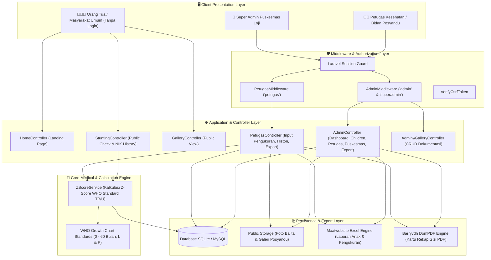
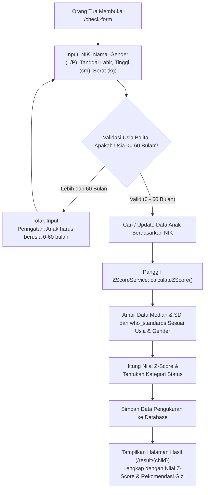

# 👶 Sistem Deteksi Stunting & Monitoring Tumbuh Kembang Anak - Puskesmas Loji

<p align="center">
  
</p>

<p align="center">
  <strong>Platform Digital Surveilans Gizi, Deteksi Dini Stunting Balita Berbasis WHO Child Growth Standards, Pengukuran Antropometri Terpadu, dan Pelaporan Puskesmas Loji Karawang</strong>
</p>

<p align="center">
  
  
  
  
  
  
</p>

---

## 📑 Daftar Isi
1. [Ringkasan Proyek & Urgensi Sistem](#-ringkasan-proyek--urgensi-sistem)
2. [Arsitektur Sistem (System Architecture)](#-arsitektur-sistem-system-architecture)
   - [Diagram Arsitektur Tingkat Tinggi](#diagram-arsitektur-tingkat-tinggi)
   - [Lapisan Arsitektur (Architectural Layers)](#lapisan-arsitektur-architectural-layers)
   - [Struktur Direktori Proyek](#struktur-direktori-proyek)
3. [Peran Pengguna & Hak Akses (User Roles & Permissions)](#-peran-pengguna--hak-akses-user-roles--permissions)
   - [Rincian Otoritas & Tanggung Jawab Role](#rincian-otoritas--tanggung-jawab-role)
   - [Matriks Hak Akses (RBAC Matrix)](#matriks-hak-akses-rbac-matrix)
4. [Alur Proses Bisnis & Logika Medis (System Workflows)](#-alur-proses-bisnis--logika-medis-system-workflows)
   - [1. Alur Deteksi Mandiri oleh Orang Tua (Public Self-Check)](#1-alur-deteksi-mandiri-oleh-orang-tua-public-self-check)
   - [2. Alur Pelacakan Riwayat Tumbuh Kembang via NIK](#2-alur-pelacakan-riwayat-tumbuh-kembang-via-nik)
   - [3. Alur Pengukuran Antropometri oleh Petugas Posyandu / Puskesmas](#3-alur-pengukuran-antropometri-oleh-petugas-posyandu--puskesmas)
   - [4. Alur Algoritma Matematis Z-Score Standar WHO](#4-alur-algoritma-matematis-z-score-standar-who)
   - [5. Alur Pengawasan, Manajemen Master & Laporan oleh Super Admin](#5-alur-pengawasan-manajemen-master--laporan-oleh-super-admin)
5. [Fitur-Fitur Unggulan Sistem (Key Features Breakdown)](#-fitur-fitur-unggulan-sistem-key-features-breakdown)
6. [Skema Database & Model Relasional](#-skema-database--model-relasional)
7. [Panduan Instalasi & Menjalankan Aplikasi (Setup Guide)](#-panduan-instalasi--menjalankan-aplikasi-setup-guide)
   - [Prasyarat Sistem](#prasyarat-sistem)
   - [Langkah-Langkah Instalasi](#langkah-langkah-instalasi)
   - [Akun Bawaan Pengujian (Default Seed Accounts)](#akun-bawaan-pengujian-default-seed-accounts)
8. [Panduan Deployment ke Server Produksi](#-panduan-deployment-ke-server-produksi)

---

## 📖 Ringkasan Proyek & Urgensi Sistem

Stunting adalah gangguan pertumbuhan dan perkembangan anak akibat kekurangan gizi kronis dan infeksi berulang, yang ditandai dengan panjang atau tinggi badannya berada di bawah standar. Periode 1000 Hari Pertama Kehidupan (HPK) adalah jendela kritis di mana deteksi dini dan intervensi gizi wajib dilakukan sebelum dampak stunting menjadi permanen.

**Sistem Deteksi Stunting Puskesmas Loji** dikembangkan sebagai solusi digital terintegrasi untuk wilayah kerja Puskesmas Loji (Kecamatan Tegalwaru, Kabupaten Karawang, Jawa Barat). Sistem ini mendigitalisasi proses surveilans gizi balita yang sebelumnya manual, meminimalisasi kesalahan interpretasi grafik buku KIA/KMS, serta menyediakan saluran mandiri bagi orang tua untuk memantau status stunting buah hatinya secara instan.

### Nilai Utama Sistem:
- **Presisi Standar WHO**: Mengacu pada *WHO Child Growth Standards (Panjang/Tinggi Badan menurut Usia)* untuk balita usia 0 hingga 60 bulan.
- **Deteksi Real-Time**: Hasil klasifikasi status gizi (Normal, Stunting, Severely Stunting, Tinggi) dan nilai Z-Score muncul seketika saat data antropometri dimasukkan.
- **Aksesibilitas Publik**: Orang tua dapat memeriksa status gizi tanpa harus membuat akun dan dapat memantau grafik perkembangan anak hanya menggunakan NIK.
- **Pelaporan Resmi Multi-Format**: Memudahkan petugas dan pimpinan Puskesmas dalam menyusun laporan bulanan ke Dinas Kesehatan melalui ekspor Excel dan PDF.

---

## 🏛️ Arsitektur Sistem (System Architecture)

Aplikasi dibangun menggunakan prinsip arsitektur **Model-View-Controller (MVC)** modern berbasis framework **Laravel 11/12** dan **PHP 8.2+**, antarmuka dinamis berbasis **Tailwind CSS 3.x**, grafik tren interaktif via **Chart.js**, serta mesin dokumen ekspor ganda (**Maatwebsite Excel** dan **Barryvdh DomPDF**).

### Diagram Arsitektur Tingkat Tinggi


```mermaid
flowchart TD
    subgraph ClientLayer["🖥️ Client Presentation Layer"]
        PublicParent["👨‍👩‍👧 Orang Tua / Masyarakat Umum (Tanpa Login)"]
        PetugasUser["👩‍⚕️ Petugas Kesehatan / Bidan Posyandu"]
        SuperAdminUser["👑 Super Admin Puskesmas Loji"]
    end

    subgraph SecurityLayer["🛡️ Middleware & Authorization Layer"]
        SessionAuth["Laravel Session Guard"]
        AdminMid["AdminMiddleware ('admin' & 'superadmin')"]
        PetugasMid["PetugasMiddleware ('petugas')"]
        CSRFProtection["VerifyCsrfToken"]
    end

    subgraph AppController["⚙️ Application & Controller Layer"]
        HomeCtrl["HomeController (Landing Page)"]
        StuntingCtrl["StuntingController (Public Check & NIK History)"]
        PublicGallery["GalleryController (Public View)"]
        
        AdminCtrl["AdminController (Dashboard, Children, Petugas, Puskesmas, Export)"]
        PetugasCtrl["PetugasController (Input Pengukuran, Histori, Export)"]
        AdminGallery["Admin\\GalleryController (CRUD Dokumentasi)"]
    end

    subgraph ServiceEngine["🧮 Core Medical & Calculation Engine"]
        ZScoreEngine["ZScoreService (Kalkulasi Z-Score WHO Standard TB/U)"]
        WHOData["WHO Growth Chart Standards (0 - 60 Bulan, L & P)"]
    end

    subgraph PersistenceExport["🗄️ Persistence & Export Layer"]
        DB[(Database SQLite / MySQL)]
        DiskStorage["Public Storage (Foto Balita & Galeri Posyandu)"]
        ExcelExport["Maatwebsite Excel Engine (Laporan Anak & Pengukuran)"]
        PdfExport["Barryvdh DomPDF Engine (Kartu Rekap Gizi PDF)"]
    end

    %% Flow connections
    PublicParent --> HomeCtrl
    PublicParent --> StuntingCtrl
    PublicParent --> PublicGallery
    StuntingCtrl --> ZScoreEngine

    PetugasUser --> SessionAuth
    SuperAdminUser --> SessionAuth

    SessionAuth --> AdminMid
    SessionAuth --> PetugasMid

    AdminMid --> AdminCtrl
    AdminMid --> AdminGallery

    PetugasMid --> PetugasCtrl
    PetugasCtrl --> ZScoreEngine

    ZScoreEngine --> WHOData
    ZScoreEngine --> DB

    AdminCtrl --> DB
    AdminCtrl --> DiskStorage
    AdminCtrl --> ExcelExport
    AdminCtrl --> PdfExport

    PetugasCtrl --> DB
    PetugasCtrl --> DiskStorage
    PetugasCtrl --> ExcelExport
    PetugasCtrl --> PdfExport
```

### Lapisan Arsitektur (Architectural Layers)

1. **Presentation Layer (Antarmuka Publik, Petugas & Admin)**:
   - **Public Portal**: Desain ramah keluarga dengan warna menenangkan, formulir pemeriksaan mandiri yang simpel, dan kartu hasil deteksi yang informatif dengan visualisasi status warna (*color-coded badge*).
   - **Dashboard Petugas & Admin**: Antarmuka responsif dengan sidebar navigasi, grafik tren bulanan kasus stunting menggunakan Chart.js, serta tabel data anak yang dilengkapi filter multi-kriteria (gender, rentang tanggal lahir, dan status gizi).
   - **Media Gallery**: Galeri kegiatan posyandu dan penyuluhan gizi terintegrasi untuk membangun transparansi program puskesmas.

2. **Security & Role Middleware Layer**:
   - **Role Separation**: Memisahkan otorisasi melalui middleware khusus `AdminMiddleware` (role: `admin` / `superadmin`) dan `PetugasMiddleware` (role: `petugas`).
   - **Public Privacy Safeguard**: Penelusuran riwayat publik hanya memerlukan validasi NIK 16 digit tanpa membocorkan data rahasia rekam medis lainnya.

3. **Calculation & Service Engine Layer**:
   - [`ZScoreService`](file:///c:/Users/ilham/Documents/web-stunting/app/Services/ZScoreService.php): Inti kalkulasi antropometri yang membandingkan tinggi badan anak terhadap nilai Median dan Standar Deviasi (SD) pada tabel referensi `who_standards` sesuai usia (bulan) dan jenis kelamin (Laki-laki / Perempuan).

4. **Persistence & Export Layer**:
   - Relasi data Eloquent ORM dengan transaksi database atomik saat pendaftaran balita dan pencatatan pengukuran.
   - Ekspor fleksibel: format Excel (.xlsx) untuk pengolahan statistik Dinas Kesehatan, dan format PDF (.pdf) untuk cetak fisik kartu pemeriksaan balita.

---

### Struktur Direktori Proyek

```text
web-stunting/
├── app/
│   ├── Exports/
│   │   ├── ChildrenExport.php              # Ekspor Kolektif Data Seluruh Balita (Excel)
│   │   ├── MeasurementExport.php           # Ekspor Data Pengukuran Petugas (Excel)
│   │   └── SingleChildExport.php           # Ekspor Riwayat Individual Anak (Excel)
│   ├── Http/
│   │   ├── Controllers/
│   │   │   ├── Auth/
│   │   │   │   ├── LoginController.php     # Autentikasi Admin & Petugas
│   │   │   │   └── RegisterController.php
│   │   │   ├── AdminController.php         # Manajemen Data Anak, Petugas, Puskesmas, Laporan
│   │   │   ├── GalleryController.php       # Galeri Dokumentasi Kegiatan Posyandu
│   │   │   ├── HomeController.php          # Landing Page Publik & Informasi Stunting
│   │   │   ├── PetugasController.php       # Input Antropometri, Riwayat & Ekspor Laporan
│   │   │   └── StuntingController.php      # Form Cek Mandiri Publik & Histori via NIK
│   │   └── Middleware/
│   │       ├── AdminMiddleware.php         # Proteksi Akses Superadmin/Admin
│   │       └── PetugasMiddleware.php       # Proteksi Akses Petugas Lapangan
│   ├── Models/
│   │   ├── Child.php                       # Model Data Anak, Umur Bulan, & Status Terkini
│   │   ├── Gallery.php                     # Model Dokumentasi Kegiatan
│   │   ├── Measurement.php                 # Model Pengukuran TB, BB, LK, LiLA, Z-Score
│   │   ├── Puskesmas.php                   # Model Profil Puskesmas Loji & Jadwal
│   │   ├── User.php                        # Model Pengguna & Role Check
│   │   └── WHOStandard.php                 # Tabel Standar Pertumbuhan WHO (-3SD s/d +3SD)
│   └── Services/
│       └── ZScoreService.php               # Algoritma Perhitungan Z-Score WHO & Status
├── database/
│   ├── migrations/                         # Struktur Skema Database Relasional
│   └── seeders/
│       ├── DatabaseSeeder.php              # Seeder Utama
│       ├── GallerySeeder.php               # Data Contoh Dokumentasi Posyandu
│       ├── PuskesmasSeeder.php             # Profil & Jadwal Resmi Puskesmas Loji
│       ├── UserSeeder.php                  # Akun Bawaan Superadmin & Petugas
│       └── WHOStandardSeeder.php           # Dataset Standar WHO (L/P 0-60 Bulan)
├── resources/
│   └── views/
│       ├── admin/                          # Panel Kontrol Superadmin
│       │   ├── children/                   # Tabel Balita, Detail, Edit & Ekspor
│       │   ├── gallery/                    # CRUD Galeri
│       │   ├── petugas/                    # Manajemen Akun Petugas Posyandu
│       │   └── dashboard.blade.php         # Statistik & Grafik Chart.js
│       ├── petugas/                        # Panel Operasional Petugas Kesehatan
│       │   ├── measurement/                # Form Input Antropometri & Riwayat
│       │   └── dashboard.blade.php         # Statistik Kerja Petugas
│       ├── public/                         # Halaman Hasil Cek & Histori NIK Publik
│       ├── stunting/                       # Form Cek Mandiri Publik
│       ├── auth/                           # Login & Reset Password
│       └── home.blade.php                  # Landing Page Edukasi Stunting
├── routes/
│   └── web.php                             # Definisi Rute Publik, Petugas, dan Admin
└── storage/
    └── app/public/                         # Penyimpanan Foto Balita & Foto Galeri
```

---

## 👥 Peran Pengguna & Hak Akses (User Roles & Permissions)

Sistem melayani 3 aktor utama dengan pemisahan wewenang yang tegas:

```
                            ┌────────────────────────┐
                            │    Super Admin / Gizi  │
                            │ (Kepala Puskesmas Loji)│
                            └───────────┬────────────┘
                                        │
                 ┌──────────────────────┴──────────────────────┐
                 │ Mengelola Petugas & Master Data             │
                 ▼                                             ▼
    ┌────────────────────────┐                    ┌────────────────────────┐
    │    Petugas Kesehatan   │                    │  Orang Tua / Publik    │
    │  (Bidan Desa/Posyandu) │                    │ (Cek Mandiri & NIK)    │
    └────────────────────────┘                    └────────────────────────┘
```

### Rincian Otoritas & Tanggung Jawab Role

#### 1. 👑 Super Admin (`superadmin` / `admin`)
- **Fokus Utama**: Tata kelola wilayah Puskesmas Loji, evaluasi prevalensi stunting bulanan, audit rekam data anak, manajemen staf posyandu, dan pelaporan dinas.
- **Wewenang**:
  - **Executive Dashboard**: Memantau metrik total anak terdaftar, total pengukuran, jumlah balita stunting (pendek & sangat pendek), serta grafik tren bulanan kasus stunting berbasis Chart.js.
  - **Manajemen Data Anak**: Melihat seluruh data anak di wilayah Puskesmas Loji, memfilter berdasarkan NIK, nama, jenis kelamin, rentang tanggal lahir, dan kategori status gizi. Memperbarui identitas anak atau menghapus data duplikat/keliru.
  - **Log Pengukuran Antropometri**: Memeriksa seluruh riwayat pengukuran yang diinput oleh semua petugas posyandu.
  - **Manajemen Petugas Kesehatan**: Menambah akun petugas posyandu/bidan baru, mengedit data login, atau menghapus akun petugas.
  - **Profil Puskesmas Loji**: Mengubah informasi resmi puskesmas, alamat, nomor telepon, email, jam layanan UGD/Persalinan 24 jam, jadwal posyandu rutin, imunisasi, dan KB.
  - **Manajemen Galeri Kegiatan**: Mengunggah foto dokumentasi kegiatan penimbangan posyandu dan penyuluhan gizi balita.
  - **Pusat Ekspor Laporan**: Mengunduh rekap data anak ke file Excel (`.xlsx`) dan kartu riwayat individu balita ke PDF.

#### 2. 👩‍⚕️ Petugas Kesehatan / Bidan Posyandu (`petugas`)
- **Fokus Utama**: Pelaksana teknis antropometri di posyandu, klinik, atau pos penimbangan balita.
- **Wewenang**:
  - **Pencatatan Antropometri Balita**: Menginput NIK 16 digit, nama lengkap anak, jenis kelamin, tanggal lahir (validasi usia 0–60 bulan), tinggi/panjang badan (cm), berat badan (kg), lingkar kepala (cm), lingkar lengan atas (LiLA), dan mengunggah foto balita.
  - **Kalkulasi Otomatis Z-Score**: Sistem secara otomatis menghitung nilai Z-score dan menetapkan status gizi begitu form disimpan.
  - **Riwayat Pengukuran Kerja**: Melihat arsip seluruh pengukuran yang telah dilakukan oleh akun petugas terkait.
  - **Ekspor Laporan Pengukuran**: Mengunduh rekapitulasi data pengukuran harian/bulanan ke format **Excel** dan **PDF**.

#### 3. 👨‍👩‍👧 Orang Tua / Masyarakat Umum (`guest / public`)
- **Fokus Utama**: Masyarakat luas, ibu balita, dan kader keluarga di wilayah Puskesmas Loji.
- **Wewenang**:
  - **Eksplorasi Informasi & Edukasi**: Mempelajari definisi stunting, bahaya jangka panjang pada perkembangan kognitif anak, serta tips intervensi 1000 HPK.
  - **Formulir Cek Stunting Mandiri (`/check-form`)**: Memasukkan data anak (NIK, nama, gender, tanggal lahir, tinggi, berat) untuk melakukan skrining cepat status gizi.
  - **Halaman Hasil Deteksi Instan (`/result/{id}`)**: Mengetahui status gizi anak secara transparan (Normal, Pendek, Sangat Pendek, Tinggi) beserta interpretasi skor Z-score.
  - **Pelacakan Pertumbuhan via NIK (`/history/{nik}`)**: Memantau grafik dan daftar riwayat pengukuran anak dari bulan ke bulan cukup dengan memasukkan nomor NIK.
  - **Galeri Posyandu**: Meninjau dokumentasi kegiatan posyandu dan edukasi kesehatan.

---

### Matriks Hak Akses (RBAC Matrix)

| Fitur / Modul Sistem | Publik / Orang Tua | Petugas Kesehatan | Super Admin |
|:---|:---:|:---:|:---:|
| Halaman Beranda & Informasi Edukasi | ✅ | ✅ | ✅ |
| Cek Status Stunting Mandiri (`/check-form`) | ✅ | ✅ | ✅ |
| Lacak Riwayat Pertumbuhan via NIK | ✅ | ✅ | ✅ |
| Galeri Kegiatan Posyandu Publik | ✅ | ✅ | ✅ |
| Login & Autentikasi Sistem | ❌ | ✅ | ✅ |
| Dashboard Petugas (Statistik Harian) | ❌ | ✅ | ❌ |
| Input Antropometri Balita (TB, BB, LK, LiLA) | ❌ | ✅ | ❌ |
| Riwayat Pengukuran Mandiri Petugas | ❌ | ✅ | ❌ |
| Ekspor Laporan Petugas (Excel & PDF) | ❌ | ✅ | ❌ |
| Dashboard Eksekutif & Grafik Prevalensi | ❌ | ❌ | ✅ |
| Manajemen Data Anak (CRUD & Filter Gizi) | ❌ | ❌ | ✅ |
| Manajemen Petugas Kesehatan (CRUD Akun) | ❌ | ❌ | ✅ |
| Pengaturan Profil Puskesmas Loji & Jadwal | ❌ | ❌ | ✅ |
| CRUD Galeri Dokumentasi Kegiatan | ❌ | ❌ | ✅ |
| Ekspor Data Anak Lengkap (Excel & PDF) | ❌ | ❌ | ✅ |

---

## 🔄 Alur Proses Bisnis & Logika Medis (System Workflows)

### 1. Alur Deteksi Mandiri oleh Orang Tua (Public Self-Check)

Orang tua dapat melakukan deteksi mandiri tanpa hambatan registrasi akun:


```mermaid
flowchart TD
    Start["Orang Tua Membuka /check-form"] --> InputData["Input: NIK, Nama, Gender (L/P), Tanggal Lahir, Tinggi (cm), Berat (kg)"]
    InputData --> ValidateAge{"Validasi Usia Balita:<br>Apakah Usia <= 60 Bulan?"}
    
    ValidateAge -- "Lebih dari 60 Bulan" --> ErrorAge["Tolak Input!<br>Peringatan: Anak harus berusia 0-60 bulan"]
    ErrorAge --> InputData

    ValidateAge -- "Valid (0 - 60 Bulan)" --> CheckOrCreate["Cari / Update Data Anak Berdasarkan NIK"]
    CheckOrCreate --> CallZScore["Panggil ZScoreService::calculateZScore()"]
    
    CallZScore --> FetchWHO["Ambil Data Median & SD dari who_standards Sesuai Usia & Gender"]
    FetchWHO --> ComputeZ["Hitung Nilai Z-Score & Tentukan Kategori Status"]
    ComputeZ --> SaveMeasurement["Simpan Data Pengukuran ke Database"]
    SaveMeasurement --> ShowResult["Tampilkan Halaman Hasil (/result/{child})<br>Lengkap dengan Nilai Z-Score & Rekomendasi Gizi"]
```

---

### 2. Alur Pelacakan Riwayat Tumbuh Kembang via NIK

Memungkinkan orang tua memantau tren perkembangan anak dari waktu ke waktu:

```
[Orang Tua Mengakses URL /history/{nik}]
  │
  ├── 1. Validasi NIK pada Database Tabel 'children'
  │      - Tidak Ditemukan: Tampilkan Notifikasi 404 (Data anak belum terdaftar)
  │      - Ditemukan       : Ambil data anak beserta seluruh relasi measurements
  │
  └── 2. Render Halaman /public/history
         - Tampilkan Identitas Balita (Nama, Gender, Tanggal Lahir, Usia Bulan)
         - Tampilkan Tabel Kronologis Pengukuran (Tanggal, Tinggi, Berat, Z-Score)
         - Tampilkan Status Gizi Berwarna:
           * Hijau  : Normal
           * Oranye : Pendek (Stunted)
           * Merah  : Sangat Pendek (Severely Stunted)
           * Ungu   : Tinggi
```

---

### 3. Alur Pengukuran Antropometri oleh Petugas Posyandu / Puskesmas

Pada hari buka Posyandu atau pemeriksaan klinik, petugas mencatat data dengan transaksi database terproteksi:

1. Petugas membuka form pengukuran di `/petugas/measurement/create`.
2. Petugas menginput data: NIK (16 digit), nama balita, jenis kelamin, tanggal lahir, tinggi/panjang badan, berat badan, lingkar kepala, dan lingkar lengan atas (LiLA).
3. Transaksi database atomik (`DB::beginTransaction()`) dijalankan:
   - Validasi usia balita tidak melebihi 60 bulan.
   - Pengecekan atau pencatatan identitas baru pada tabel `children`.
   - `ZScoreService` menghitung Z-score tinggi badan menurut usia secara otomatis.
   - Entri baru disimpan pada tabel `measurements` dengan mencatat `user_id` petugas penilai.
4. Transaksi berhasil disahkan (`DB::commit()`) dan petugas menerima notifikasi instan.

---

### 4. Alur Algoritma Matematis Z-Score Standar WHO

Kalkulasi Z-score pada [`ZScoreService`](file:///c:/Users/ilham/Documents/web-stunting/app/Services/ZScoreService.php) mengimplementasikan standar internasional pertumbuhan anak WHO:

#### Rumus Perhitungan:
Untuk setiap kombinasi `age_months` (0 s/d 60 bulan) dan `gender` (`L` atau `P`), sistem mengambil parameter dari tabel `who_standards`:
- `median`: Nilai median tinggi badan standar
- `minus_1sd`: Batas -1 Standar Deviasi
- `plus_1sd`: Batas +1 Standar Deviasi

$$\text{Jika } Height = Median \implies Z = 0.0$$

$$\text{Jika } Height < Median \implies Z = \frac{Height - Median}{Median - (-1SD)}$$

$$\text{Jika } Height > Median \implies Z = \frac{Height - Median}{(+1SD) - Median}$$

#### Klasifikasi Ambang Batas Status Gizi (*Cut-Off Points*):
| Nilai Z-Score (SD) | Status Antropometri | Klasifikasi Klinis | Tindakan Rekomendasi |
|:---:|:---:|:---:|---|
| **$Z < -3.00$** | **Sangat Pendek** | *Severely Stunted* | Rujukan segera ke dokter spesialis anak / faskes rujukan |
| **$-3.00 \le Z < -2.00$** | **Pendek** | *Stunted* | Intervensi Pemberian Makanan Tambahan (PMT) & konseling gizi |
| **$-2.00 \le Z \le +3.00$** | **Normal** | Gizi Baik & Sesuai | Pertahankan pola asuh, ASI eksklusif / gizi seimbang |
| **$Z > +3.00$** | **Tinggi** | *Tall* | Pertumbuhan di atas rata-rata populasi sebayanya |

---

### 5. Alur Pengawasan, Manajemen Master & Laporan oleh Super Admin

Super Admin mengawasi seluruh aktivitas pelayanan melalui panel kendali:
- **Analisis Dashboard**: Memantau grafik statistik bulanan kasus stunting (`monthlyStats`) untuk mengevaluasi keberhasilan program intervensi gizi puskesmas.
- **Penyaringan Data Canggih**: Menyaring data balita berdasarkan status spesifik, tanggal penimbangan, jenis kelamin, atau pencarian nama/NIK.
- **Ekspor Dokumen**: Mengunduh dataset balita ke file Excel atau mencetak resume pemeriksaan individual ke file PDF.

---

## ✨ Fitur-Fitur Unggulan Sistem (Key Features Breakdown)

### 1. 📏 Standar Pertumbuhan Internasional WHO Terintegrasi
- Menggunakan dataset komprehensif Standar Pertumbuhan Anak WHO untuk anak laki-laki dan perempuan usia 0–60 bulan.
- Menghasilkan diagnosis Z-score yang presisi dan diakui secara medis tanpa perlu melihat tabel buku manual.

### 2. 🔍 Pemeriksaan Mandiri Tanpa Login & Riwayat NIK
- Memberikan kemudahan bagi orang tua untuk mendeteksi stunting dari rumah melalui peramban ponsel.
- Privasi terlindungi: Cukup menggunakan nomor NIK untuk membuka buku riwayat tumbuh kembang anak.

### 3. 📊 Visualisasi Data Interaktif (Chart.js)
- Grafik batang/garis bulanan yang menampilkan rasio balita Normal, Pendek, dan Sangat Pendek dalam tahun berjalan.
- Memberikan gambaran cepat bagi kepala puskesmas untuk mengambil kebijakan penanganan stunting.

### 4. 📑 Ekspor Laporan Ganda (Excel & PDF)
- **Ekspor Excel (`Maatwebsite/Excel`)**: Format tabel lengkap siap olah untuk rekap data bulanan Dinas Kesehatan.
- **Ekspor PDF (`Barryvdh/DomPDF`)**: Format dokumen siap cetak untuk kartu pemantauan fisik balita.

### 5. 🏥 Manajemen Profil Puskesmas & Jadwal Terpadu
- Mengelola data operasional Puskesmas Loji Karawang, jadwal Posyandu berkala, jadwal Imunisasi, KB, serta kontak darurat 24 jam.

### 6. 📸 Dokumentasi Galeri Program Intervensi Gizi
- Pengelolaan album foto kegiatan penyuluhan, posyandu balita, dan pembagian makanan tambahan (PMT) yang dapat dilihat oleh publik.

---

## 🗄️ Skema Database & Model Relasional

Sistem menggunakan 6 model database yang saling terhubung secara optimal:

```
┌────────────────────────┐       1:N       ┌────────────────────────┐
│        children        ├─────────────────┤      measurements      │
│  (Data Pribadi Balita) │                 │  (Pengukuran & Z-Score)│
└────────────────────────┘                 └───────────▲────────────┘
                                                       │
┌────────────────────────┐                             │ N:1
│         users          ├─────────────────────────────┘
│ (Superadmin & Petugas) │
└────────────────────────┘

┌────────────────────────┐
│     who_standards      │
│(Tabel Standar Median/SD│
│  Usia 0-60 Bln, L & P) │
└────────────────────────┘

┌────────────────────────┐                 ┌────────────────────────┐
│       puskesmas        │                 │       galleries        │
│(Profil Puskesmas Loji) │                 │(Dokumentasi Kegiatan)  │
└────────────────────────┘                 └────────────────────────┘
```

### Rangkuman Model Data Utama:
- **`Child`**: Menyimpan identitas balita (`nik`, `name`, `gender`, `birth_date`, `photo`). Memiliki relasi `measurements()` dan helper `age_in_months`, `age_display`, serta `latest_status`.
- **`Measurement`**: Menyimpan data pengukuran antropometri (`child_id`, `user_id`, `age_months`, `height`, `weight`, `head_circumference`, `arm_circumference`, `z_score`, `status`, `measurement_date`).
- **`WHOStandard`**: Dataset standar pertumbuhan WHO (`age_months`, `gender`, `minus_3sd`, `minus_2sd`, `minus_1sd`, `median`, `plus_1sd`, `plus_2sd`, `plus_3sd`).
- **`User`**: Akun pengguna sistem (`name`, `email`, `password`, `role`). Mendukung peran `superadmin`, `admin`, dan `petugas`.
- **`Puskesmas`**: Data institusi Puskesmas Loji (`name`, `address`, `phone`, `email`, `schedule`).
- **`Gallery`**: Dokumentasi kegiatan posyandu dan penyuluhan gizi.

---

## 🚀 Panduan Instalasi & Menjalankan Aplikasi (Setup Guide)

Ikuti petunjuk di bawah ini untuk menyiapkan dan menjalankan proyek di lingkungan pengembangan lokal (*Local Development Environment*).

### Prasyarat Sistem
Pastikan komputer Anda telah terpasang:
- **PHP** versi 8.2 atau lebih tinggi (dengan ekstensi: `pdo`, `mbstring`, `openssl`, `tokenizer`, `xml`, `ctype`, `json`, `bcmath`, `fileinfo`, `gd`)
- **Composer** (PHP Package Manager)
- **Node.js** (Minimal versi 18.x) & **NPM**
- **Database Server**: SQLite (bawaan) atau MySQL 8.0+ / MariaDB 10.4+
- **Git**

---

### Langkah-Langkah Instalasi

#### 1. Clone Repository
Buka terminal dan unduh repositori proyek:
```bash
git clone https://github.com/ISHASII/web-stunting.git
cd web-stunting
```

#### 2. Install Dependensi Backend (PHP)
```bash
composer install
```

#### 3. Install Dependensi Frontend (Node.js)
```bash
npm install
```

#### 4. Konfigurasi Environment (`.env`)
Salin file template `.env.example` ke `.env`:
```bash
# Pengguna Windows (PowerShell / Command Prompt)
copy .env.example .env

# Pengguna Linux / macOS
cp .env.example .env
```

Buka file `.env` dan sesuaikan pengaturan database Anda:
- **Jika menggunakan SQLite (Rekomendasi Cepat Development)**:
  ```env
  DB_CONNECTION=sqlite
  DB_DATABASE=database/database.sqlite
  ```
  *(Pastikan file database dibuat jika belum ada: `touch database/database.sqlite` atau via PowerShell: `type nul > database\database.sqlite`)*

- **Jika menggunakan MySQL**:
  ```env
  DB_CONNECTION=mysql
  DB_HOST=127.0.0.1
  DB_PORT=3306
  DB_DATABASE=deteksi_stunting
  DB_USERNAME=root
  DB_PASSWORD=
  ```

#### 5. Generate Application Key
```bash
php artisan key:generate
```

#### 6. Buat Symbolic Link Storage
Agar foto anak dan foto galeri posyandu dapat diakses publik dari peramban:
```bash
php artisan storage:link
```

#### 7. Migrasi Database & Seeding Dataset WHO Standar
Jalankan migrasi tabel beserta seluruh seeder (User, Puskesmas, Galeri, dan Dataset WHO Standard):
```bash
php artisan migrate --seed
```

> [!IMPORTANT]
> Seeder `WHOStandardSeeder` wajib dijalankan karena memuat data standar median dan standar deviasi WHO dari usia 0 hingga 60 bulan yang menjadi fondasi perhitungan Z-score.

#### 8. Menjalankan Server Aplikasi
Jalankan server pengembangan Laravel dan compiler aset frontend:

**Terminal 1 (Laravel Server):**
```bash
php artisan serve
```

**Terminal 2 (Vite Compiler):**
```bash
npm run dev
```

#### 9. Akses Sistem
Buka peramban web dan akses tautan berikut:
- 👶 **Halaman Utama Edukasi Stunting**: 👉 **[http://localhost:8000](http://localhost:8000)**
- 📏 **Form Pemeriksaan Stunting Mandiri**: 👉 **[http://localhost:8000/check-form](http://localhost:8000/check-form)**
- 🔐 **Pintu Masuk Login Petugas & Admin**: 👉 **[http://localhost:8000/login](http://localhost:8000/login)**

---

### Akun Bawaan Pengujian (Default Seed Accounts)

Setelah proses `migrate --seed` selesai, Anda dapat login menggunakan kredensial default berikut:

| Peran Pengguna | Email Login | Password | Hak Akses Utama |
|:---|:---|:---:|:---|
| **Super Admin** | `admin@puskesmas.go.id` | `admin123` | Akses penuh dashboard prevalensi, manajemen balita, petugas, puskesmas, dan ekspor data |
| **Petugas Kesehatan 1** | `budi@puskesmas.go.id` | `petugas123` | Input pengukuran antropometri, cek status Z-score, riwayat pengukuran, dan ekspor laporan |
| **Petugas Kesehatan 2** | `siti@puskesmas.go.id` | `petugas123` | Pelayanan penimbangan posyandu wilayah kerja Puskesmas Loji |

---

## 🛠️ Panduan Deployment ke Server Produksi

Saat mendistribusikan aplikasi ke server produksi (*Production Server / Cloud VPS*):

1. **Build Aset Frontend**:
   ```bash
   npm run build
   ```
2. **Optimasi Cache Konfigurasi & Route**:
   ```bash
   php artisan config:cache
   php artisan route:cache
   php artisan view:cache
   ```
3. **Pengaturan `.env` Produksi**:
   ```env
   APP_ENV=production
   APP_DEBUG=false
   ```
4. **Hak Akses Direktori**:
   Pastikan direktori storage dan cache memiliki izin tulis yang tepat:
   ```bash
   chmod -R 775 storage bootstrap/cache
   ```

---

<br/>

<p align="center">
  <strong>Puskesmas Loji Karawang</strong> &copy; 2026. Seluruh hak cipta dilindungi undang-undang.<br/>
  <em>Cegah Stunting, Wujudkan Generasi Emas Indonesia yang Sehat dan Cerdas.</em>
</p>
